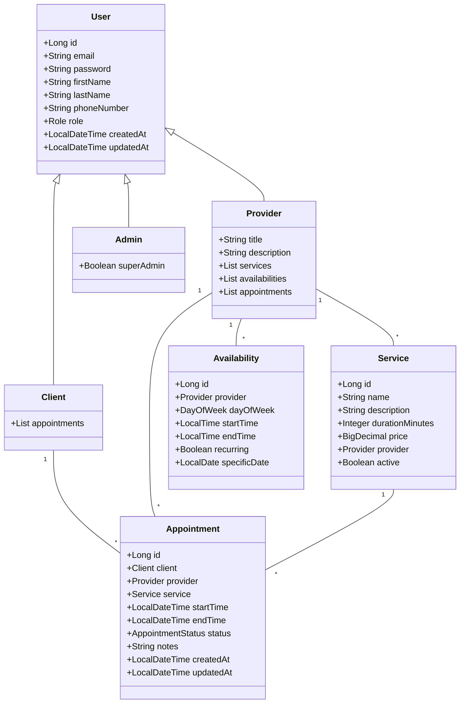
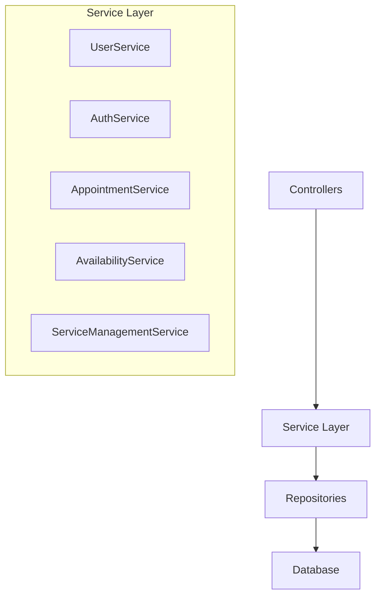
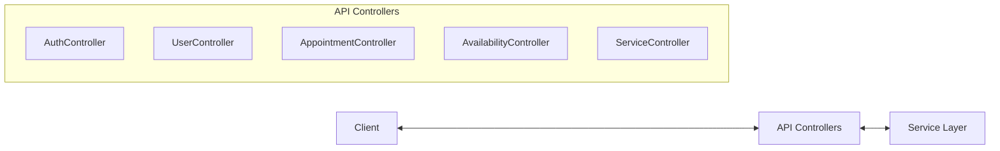
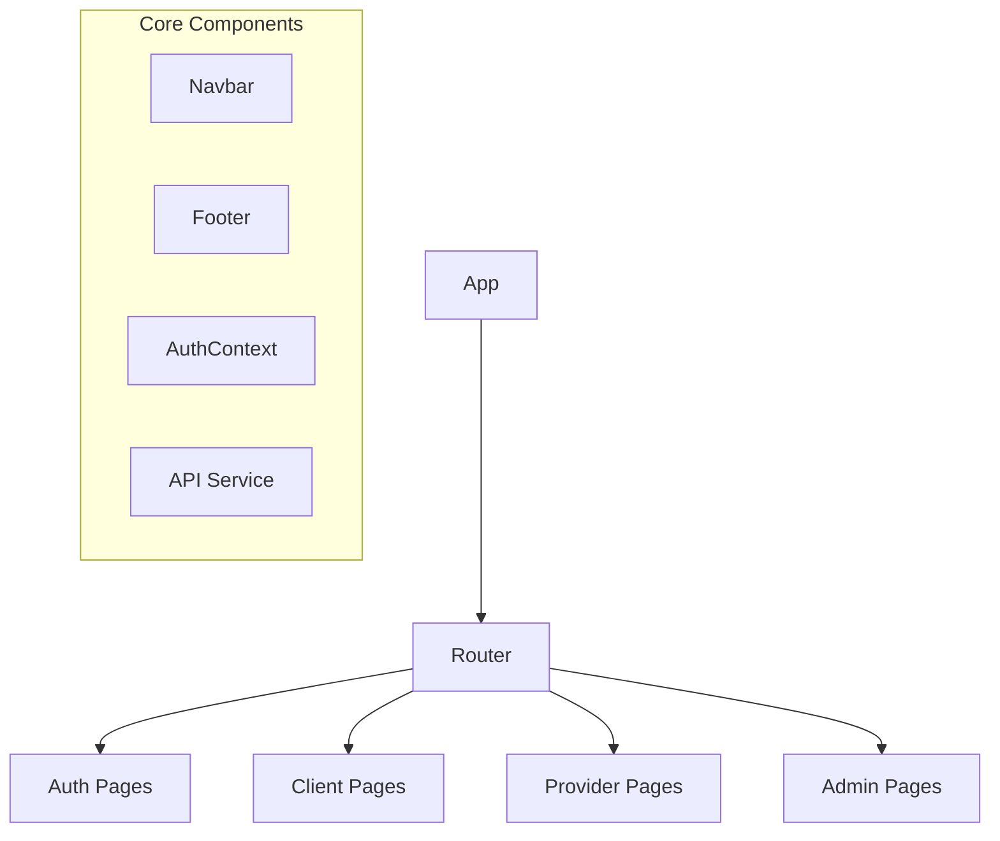
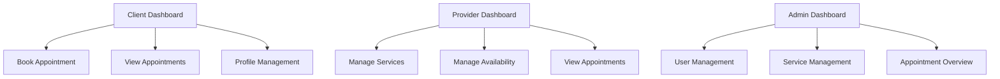
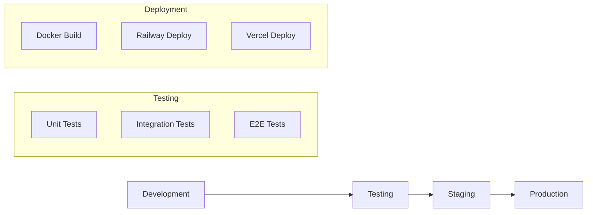

# Appointment Scheduling System - Implementation Steps

Based on the implementation plan and current project state, here's a detailed plan for moving forward:

## Current Project State

1. **Backend**:
   - Basic Spring Boot application structure is in place
   - Configured to use MySQL with Hibernate
   - Flyway is enabled for database migrations, but no migration files exist yet
   - Docker configuration is set up for the backend and database

2. **Frontend**:
   - Directory exists but is currently empty
   - No React application has been initialized yet

3. **Documentation**:
   - Implementation plan is stored in docs/implementation-plan.md
   - README.md has been updated with project overview and references

## Detailed Implementation Plan

### Phase 1: Backend Domain Model & Database Design

#### Tasks:

1. **Create Database Migration Files**:
   - Create initial schema migration for users, roles
   - Create schema for services
   - Create schema for availability
   - Create schema for appointments

2. **Implement Domain Entities**:
   - User (base class)
   - Client, Provider, Admin (extending User)
   - Service
   - Availability
   - Appointment

3. **Create Repositories**:
   - UserRepository
   - ClientRepository
   - ProviderRepository
   - ServiceRepository
   - AvailabilityRepository
   - AppointmentRepository

### Phase 2: Backend Service Layer

#### Tasks:

1. **Implement Service Interfaces**:
   - UserService
   - AuthService
   - AppointmentService
   - AvailabilityService
   - ServiceManagementService

2. **Implement Service Implementations**:
   - Business logic for user management
   - Authentication and authorization
   - Appointment scheduling logic
   - Availability management
   - Service management

3. **Create DTOs**:
   - Request/response objects for all entities
   - Mappers between entities and DTOs

### Phase 3: Backend API Layer

#### Tasks:

1. **Implement REST Controllers**:
   - AuthController
   - UserController
   - AppointmentController
   - AvailabilityController
   - ServiceController

2. **Configure Security**:
   - JWT authentication
   - Role-based authorization
   - Security filters

3. **Set Up API Documentation**:
   - Configure Swagger/OpenAPI
   - Document all endpoints

### Phase 4: Frontend Setup and Core Components

#### Tasks:

1. **Initialize React Application**:
   - Set up project with Create React App or Vite
   - Configure routing with React Router
   - Set up state management

2. **Implement Authentication**:
   - Login/Register pages
   - JWT handling
   - Protected routes

3. **Create Core Components**:
   - Layout components
   - Form components
   - API service for backend communication

### Phase 5: Frontend Feature Implementation

#### Tasks:

1. **Implement Client Features**:
   - Dashboard
   - Service browsing
   - Appointment booking
   - Appointment management

2. **Implement Provider Features**:
   - Dashboard
   - Service management
   - Availability management
   - Appointment management

3. **Implement Admin Features**:
   - Dashboard
   - User management
   - Service oversight
   - System statistics

### Phase 6: Testing and Deployment

#### Tasks:

1. **Backend Testing**:
   - Unit tests for services
   - Integration tests for APIs
   - Performance testing

2. **Frontend Testing**:
   - Component tests
   - Integration tests
   - E2E tests

3. **Deployment Setup**:
   - Finalize Docker configuration
   - Set up CI/CD pipeline
   - Configure production environments

## Implementation Order

1. **First Sprint: Backend Foundation**
   - Create database migration files
   - Implement domain entities
   - Set up repository layer
   - Implement core service layer

2. **Second Sprint: Backend API**
   - Implement REST controllers
   - Configure security
   - Set up API documentation
   - Create integration tests

3. **Third Sprint: Frontend Foundation**
   - Initialize React application
   - Set up routing and state management
   - Implement authentication
   - Create core components

4. **Fourth Sprint: Frontend Features**
   - Implement client features
   - Implement provider features
   - Implement admin features
   - Create component tests

5. **Fifth Sprint: Integration and Deployment**
   - Integrate frontend and backend
   - Set up CI/CD pipeline
   - Deploy to staging environment
   - Perform end-to-end testing

6. **Sixth Sprint: Finalization**
   - Fix bugs and issues
   - Optimize performance
   - Complete documentation
   - Deploy to production